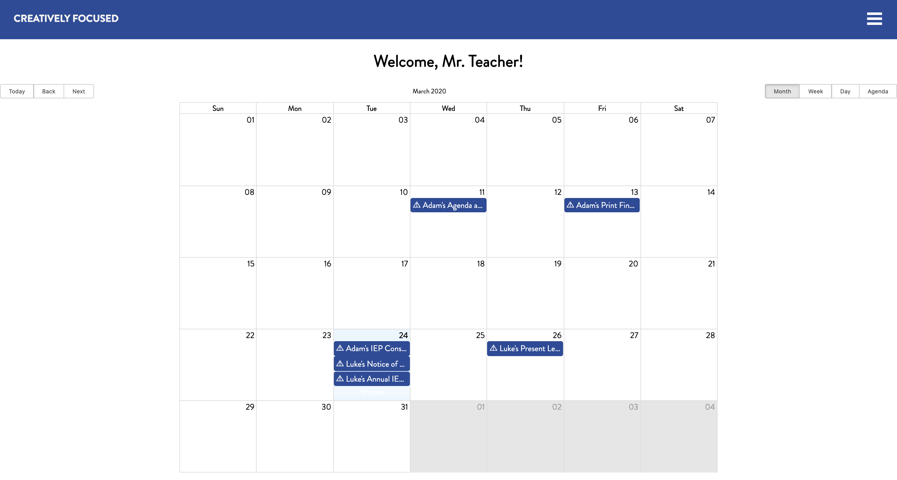
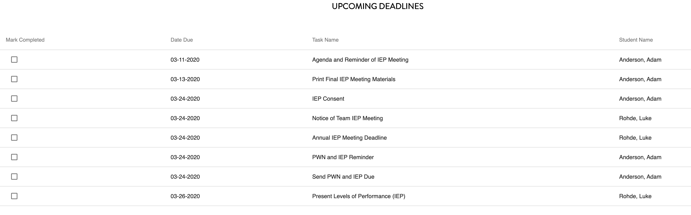
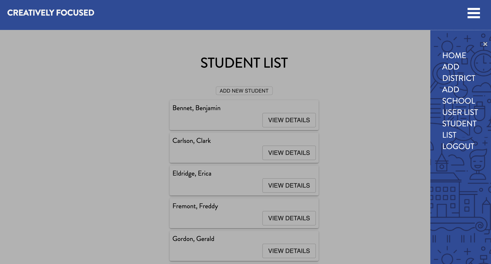
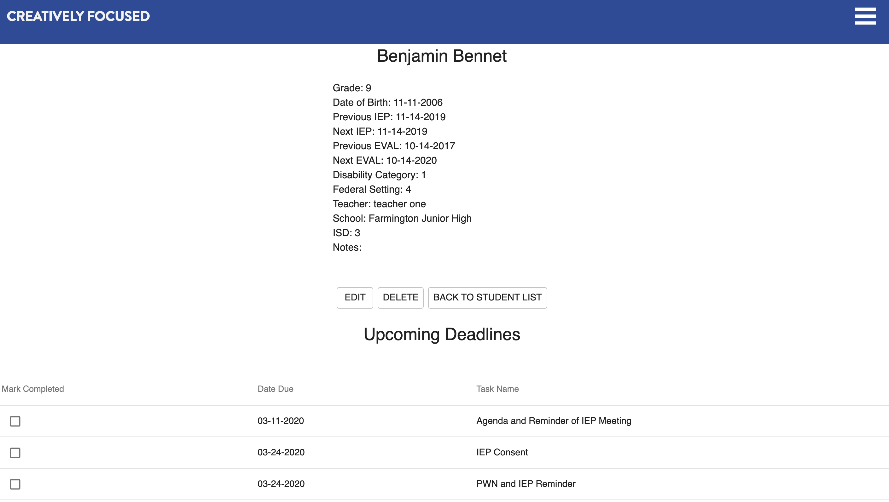
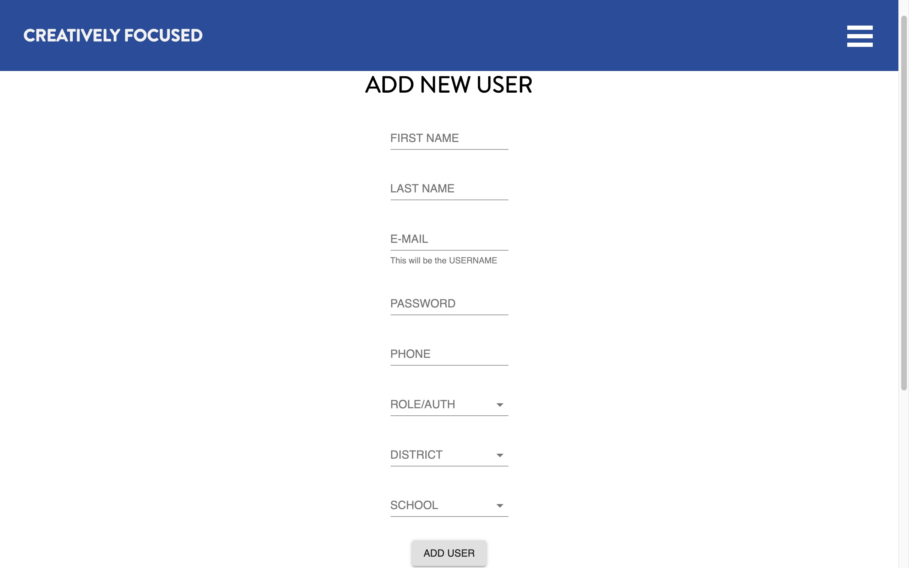
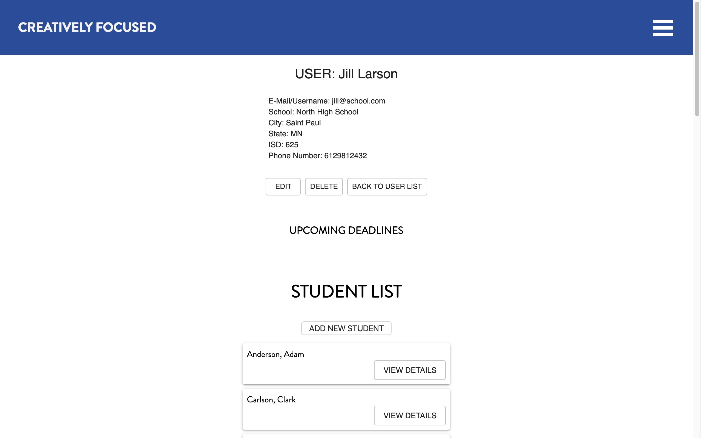

# Creatively Focused
Group Project for Prime Digital Academy

Client: Creatively Focused - Elizabeth Orme, Matthew Lasure, Becky Vavrichek

Group: Aliye Berento, Luke Rohde, Ken Slack, and Paige Wielgos

Duration: 2 week sprint

This is a web application that helps teachers keep track of mandatory meetings for all of their students. The app will allow teachers to visually see their workload through a calendar and regulate scheduling conflicts. There will be a set of email and/or text reminders for upcoming dates. This will allow teachers to be mindful of the amount of work they are doing and plan accordingly. Teachers may also add new students in which the student's IEP and Eval dates will be auto-generated within the regulated time constraints. Administrators may add a school, school district, teacher, and visually see all of their teacher's upcoming due dates.

## Preview








## Prerequisites

Before you get started, make sure you have the following software installed on your computer:

* Node.js
* PostrgeSQL
* Nodemon

This version uses React, Redux, Express, Passport, PostgreSQL, Twilio, Cron, React-Big-Calendar, and other dependencies that will be found in the package.json.

## Database Setup Instructions

Create a new database called `creatively-focused`. Copy and paste the PostmanPrimeGroupRoutes.json file's text into Postman via IMPORT, 'paste raw text'. Run the three routes provided there in order to create an administrator account.

Copy all of the database.sql code into Postico and run all of the CREATE TABLE and ALTER TABLE commands in order to produce the database.

## Installation

* Run `npm install`
* Create an `.env` file at the root of the project and paste this line into the file:
    ```
    SERVER_SESSION_SECRET=superDuperSecret
    ```
    While you're in your new `.env` file, take the time to replace `superDuperSecret` with some long random string like `25POUbVtx6RKVNWszd9ERB9Bb6` to keep your application secure. Here's a site that can help you: [https://passwordsgenerator.net/](https://passwordsgenerator.net/). If you don't do this step, create a secret with less than eight characters, or leave it as `superDuperSecret`, you will get a warning.
* You will also need to insert these lines into the file 
for setting up Nodemailer and Twilio.
```
EMAIL=your_created_email@gmail.com
PASSWORD=UUuNzcJVs62WL6F#
``` 
* You will need to make an account with Twilio to recieve a session password.
* Start postgres if not running already by using `brew services start postgresql`
* Run `npm run server`
* Run `npm run client`
* Navigate to `localhost:3000`

## Usage

* User - Teachers
    - Add students to their class
    - Edit student's personal information and relevant dates
    - View all upcoming events
    - Add events and meetings for students
    - Check off completed tasks
    - Set preferred notification setting for either text, email, or both

* Admin - Principals, District Managers, Other Staff
    - Add new application users (classroom teachers, school principals, district superintendents, as well as other case workers), districts, schools and other admins
    - View all events for their assigned teachers, school, etc.


## Built With

* React
* Redux
* Node.js
* Express.js
* Passport
* PostgreSQL
* CSS
* Material-UI
* Nodemailer
* Twilio
* React Big Calendar


## Challenges

* Learning new technologies, of which there were many: NodeMailer, Twilio, React Big Calendar
* The database presented many challenges due to its sheer scope and relational complexity

## Future Plans/Improvements

* Admin usability
    - Create their own task list
    - Filter views for calendar, tasks, events, etc.
* Over-built database to accomodate usage beyond local and state borders
* Functionality within email reminders (mark tasks as complete)
* Better indication for congested calendar
* Yearly calendar view in accordance to local school calendar

## Current Bugs

* If the user is logged in as an admin or teacher and adds a new student, school, etc. the new item may not show up. In this case, refresh the page and it should show up.

## Acknowledgement

Thank you Prime Digital Academy, our instructors Dane, Kris, and Casie, our cohort Vigenere, and our clients Elizabeth, Beck, and Matt of Creatively Focused.

## Support

If you have any questions or comments please email creativelyfocused50@gmail.com. If you would like to know more about Creatively Focused or know any teachers that may need their support, please visit www.creativelyfocused.org/
